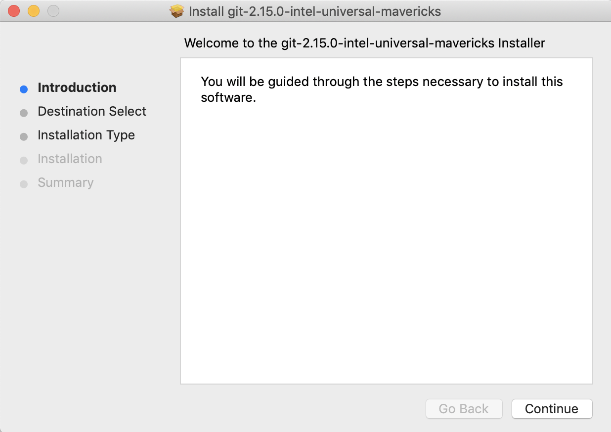
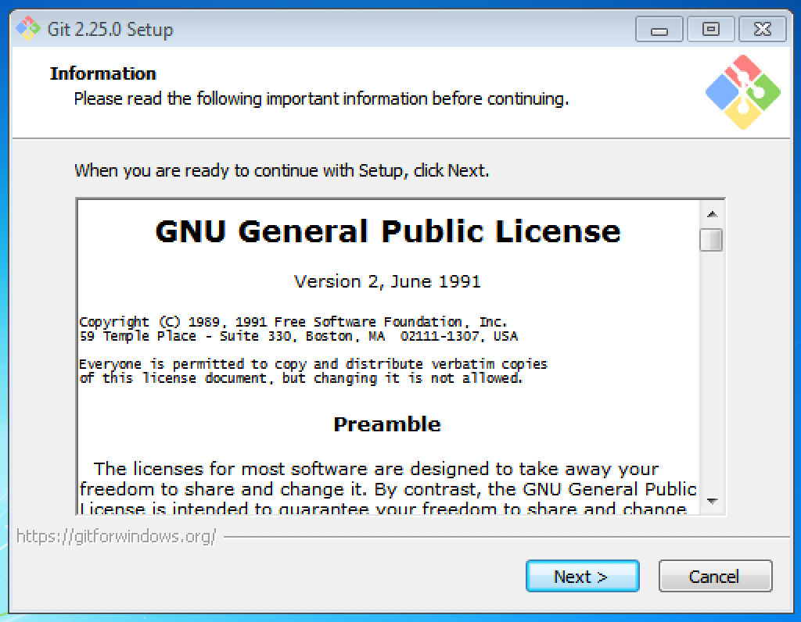

# Setting Up Git

First, create an account on [GitHub][github] or [GitLab][gitlab]. Both are hosting sites for online Git repositories. In your account, you can create online repositories for your code. Next, follow the instructions below for your respective OS to set up git on your machine.

**Note:** For more information on Git and why we use it, please see the “Brief Introduction To Git” section below. 

##### **[Mac][mac-git-ref]**:

- **Git for Mac Installer**

1. Download the latest Git for Mac installer. 

2. Follow the prompts to install Git. 



3. Open a terminal and verify the installation was successful by typing **git --version**:

```sh
$ git --version
git version 2.15.1
```

##### **[Windows][windows-git-ref]**:

- **Git for Windows Installer**

1. Download the latest Git for Windows installer.

2. Run the installer and you should see the Git Setup wizard screen. You can leave most of the default options as is, except where noted below. 



 **Note:** Git Bash is an application for Microsoft Windows environments which provides an emulation layer for a Git command line experience. It is a useful option for users to interface with git through written commands. Click [here][git-bash] for information on using Git Bash. 

Please choose the following option during installation:


Follow the Next and Finish prompts to complete the installation. 

3. Open a Command Prompt or Git Bash from the Start menu to start using Git.

##### **[Linux][linux-git-ref]**:

On Linux, you can install git using the following commands for your respective OS.

- **Debian / Ubuntu (apt-get)**

Git packages are available via apt:

1. From your shell, install Git using apt-get (enter your password if prompted): 

```sh
$ sudo apt-get update 
$ sudo apt-get install git
```

2. Verify the installation was successful by typing **git --version**: 

```sh
$ git --version
git version 2.20.1
```

- **Fedora (dnf/yum)**

Git packages are available via both yum and dnf: 

1. From your shell, install Git using dnf (or yum, on older versions of Fedora):

```sh
$ sudo dnf install git
```

Or

```sh
$ sudo yum install git
```

Note: You may be asked to confirm the download and installation - enter y to confirm. 

2. Verify the installation was successful by typing git --version:

```sh
$ git --version
 git version 2.20.1
```

If your OS is not listed above, please check the installation instructions [here] [linux-other-os] (click on the Linux tab).

## Brief Introduction To Git

Git (or any version control software) is a tool used to help developers keep track of code changes and create documentation during software development. It is designed for coordinating work among programmers, but it can be used to track changes in any set of files. 

Some advantages of using Git are:
- If you make a mistake in your code, you can easily revert back to a working version of your code
- You can review the edit history of your code
- You can make multiple versions of your code using branches (see below) 
to work on experimental changes or features without breaking your working code
- You can keep track of contributions to the code when working as part of a team 
- Companies use version control, so it is very useful to learn

##### Configuring Git: 

After downloading Git, you should configure your name and email on Git. Git needs your identity to document the contributor whenever there is a change to the code. Use the two following commands:

```sh
$ git config --global user.name "Your Name" 
$ git config --global user.email "yourname@name.com"
```
This will set your username and password in your Git configuration file (**~/.gitconfig**), so that it will be visible for every commit and change you push to Git. 

##### Creating or Cloning a Git Repository:

To turn a project into a Git repository, go inside the project folder and use the command: 

```sh
$ git init
```
This will create a new Git repository and a folder to track history. No other changes will be made to your repository by doing this.

If you want to clone an existing Git repository and you know the location of the repository, you can also make a copy of the repository into your current directory:

```sh
$ git clone <repository_url.git> 
```

This creates a folder with the same name as the cloned repository in the directory where you run the command, which is initialized with a .git folder containing information about the "upstream" or origin branch where it was cloned from. The **repository_url.git** can be found on the online project page where the project is being hosted, such as GitHub or another hosting site. 

##### Staging and Committing Changes::

To save changes you make to your code, you can enter a “commit.” This is a snapshot of changes to your code at the point at which the commit is created. 

You need to manually specify which files will have their changes marked in the commit. This is known as staging your files. If you’ve added new files to the project, you can track their changes by using:

```sh
$ git add yourfilename 
```
If you want to stage all of the files in your project, you can use the command:

```sh
$ git add -A 
```
To commit the changes, use the following command:
```sh
$ git commit
```
Generally, we type in a message to go along with the commit, documenting the changes made for the current commit. 
```sh
$  git commit -m "your commit message here"
```
i.e.
```sh
$ git commit -m "fixed bug in parsing files"
```

If you accidentally git added a file that you do not want to be staged for commit, you can unstage it. Note that this does not change the contents of the file. All it does is remove it from being included in your commit so that when you commit, any changes made to that file will not be recorded. This command is essentially the opposite of git add. 
```sh
$ git reset yourfilename
```
**Note:** _When To Commit?_ Generally, you should commit every time you reach a small milestone in your code, such as completing one feature or functionality. Committing often will reduce debugging time to fix your code, because you can roll back to a previous commit where you code was working. 

##### Pulling and Merging:

To pull new changes from the remote repository to update your local project, use:
```sh
$ git pull 
```

If there are conflicts on the same line of code in a file between your version of the file and the origin branch, Git might not be able to resolve your new commit with the pulled changes. In that case, you'll have to open the file(s) where the conflict occurs and manually edit the code to choose either the remote or local version, and then commit these changes. 

##### Pushing: 

To push changes to the remote repository so that it includes your local project, first make a commit of the code that you want to push. Then, use the command (see documentation [here][git-push]):

```sh
$ git push
```
##### Branching:
In Git, you can create branches of your code for trying out new features or experimenting with your code without the risk of breaking the functionality of the main code (in the master branch). If you want to keep the changes of the new branch, you can merge the code in that branch back into the master branch. 

To create a new branch:
```sh
$ git branch branchname
```
To move into a new branch to start working on that branch:
```sh
$ git checkout branchname
```
Once you finish working on that branch and want to move to the master branch and merge the changes:
```sh
$ git checkout master	

$ git merge branchname
```

After the merge, any changes made in the new branch will be present in your master branch. Here, you may also run into merge conflicts and have to manually resolve them and re-commit the change.

#### Checklist:
Congratulations! Now, you should be able to:

- Create a new repository using Git for your project
- Enter commits to keep track of changes to your code 
- Pull changes from a remote repository 
- Push changes to a remote repository
 - Create new branches to experiment with your code and implement new features

#### Other Useful Commands

There are many other useful commands you may need for working with git. Some are listed below. Please check the links under “Useful Guides & Resources” for more information, tutorials, and documentation for Git. 

If you want to check with files have been changed since the last commit, or if you want to see new files or files staged for commit, you can use

```sh
$ git status
```

to check the status of your repository.

To see the changes in the files you've made since your last commit line by line, use the following command:

```sh
$ git diff
```

To view the commit history use:

```sh
$ git log
```

#### Useful Guides & Resources:
- [The Official Git Homepage][git-homepage]
- [Interactive Git Tutorial][git-tutorial]
- [GitHub Introduction][git-intro] & [GitHub Help Page][github-help]
- [Atlassian Git Tutorials and Training][atlassian-tutorial]
- [Basic Git Commands][commands-ref]


[github]: <https://github.com>
[gitlab]: <https://gitlab.com/>
[mac-git-ref]: <https://sourceforge.net/projects/git-osx-installer/files/>
[windows-git-ref]: <https://www.linode.com/docs/development/version-control/how-to-install-git-on-linux-mac-and-windows/>
[git-bash]: <https://www.atlassian.com/git/tutorials/git-bash>
[linux-git-ref]: <https://www.atlassian.com/git/tutorials/install-git#linux>
[linux-other-os]: <https://www.linode.com/docs/development/version-control/how-to-install-git-on-linux-mac-and-windows/>
[git-push]: <https://www.atlassian.com/git/tutorials/syncing/git-push>
[git-homepage]: <https://git-scm.com/>
[git-tutorial]: <https://try.github.io/>
[git-intro]: <https://guides.github.com/activities/hello-world/>
[github-help]: <https://help.github.com/en>
[atlassian-tutorial]: <https://www.atlassian.com/git/tutorials>
[commands-ref]: <https://confluence.atlassian.com/bitbucketserver/basic-git-commands-776639767.html>
