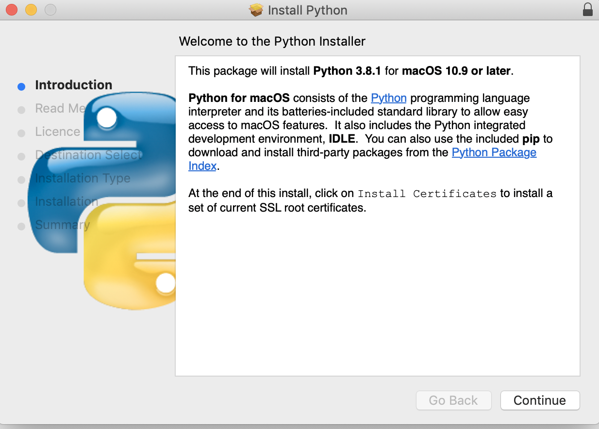
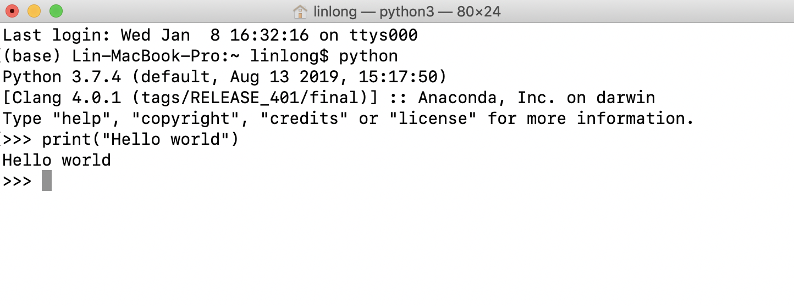
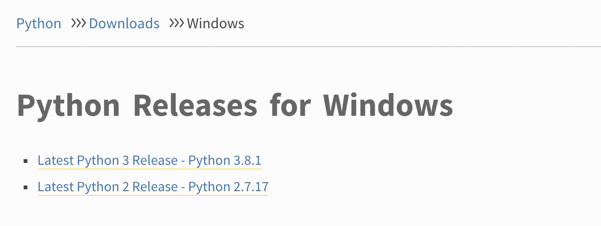
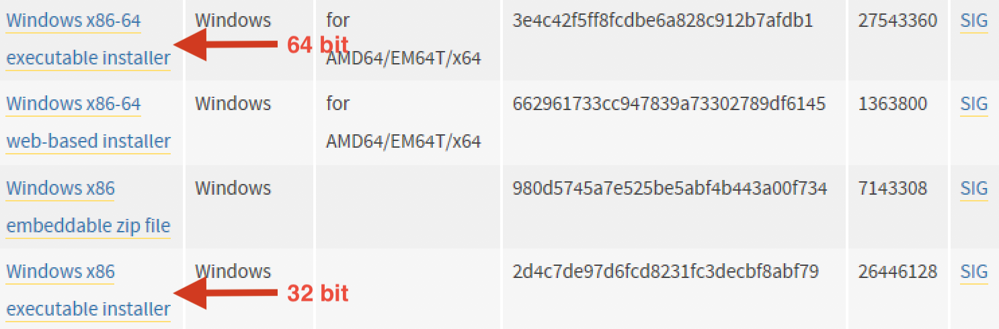
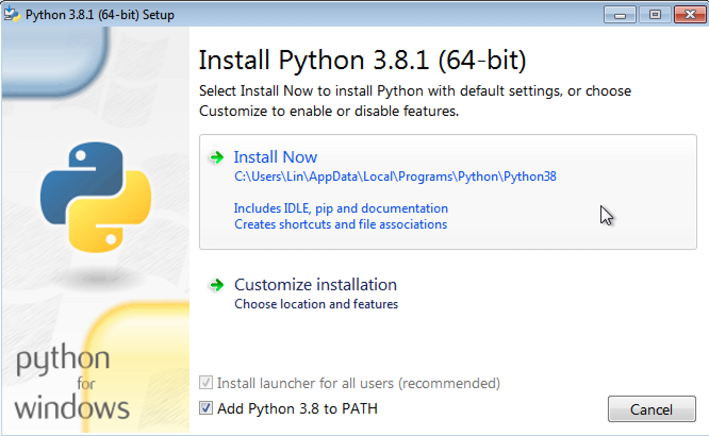
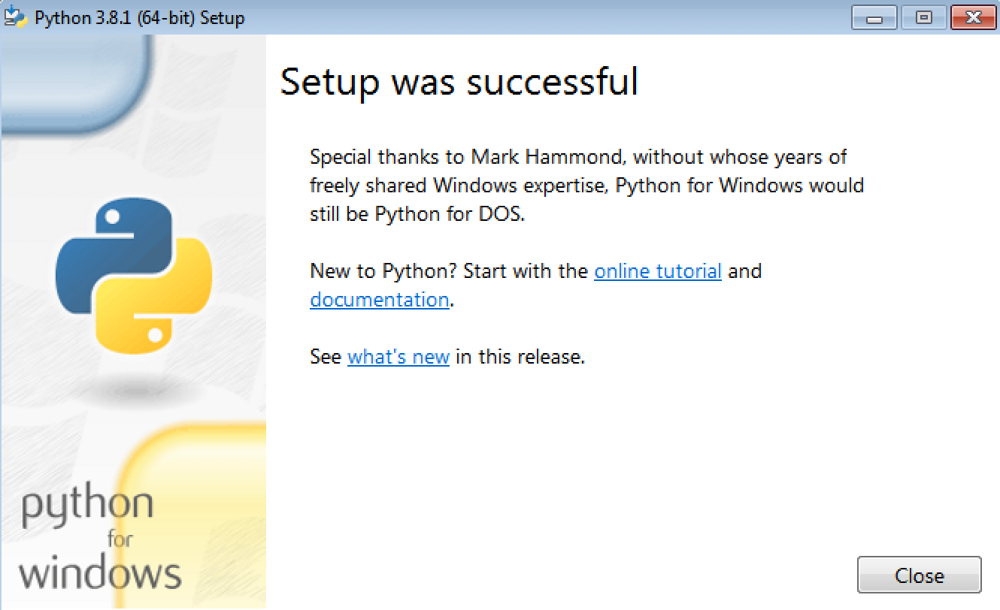
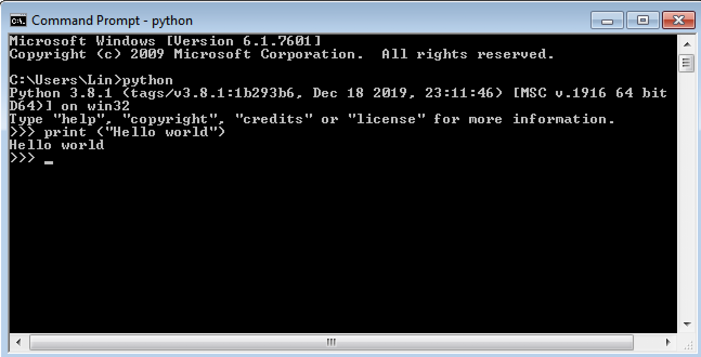
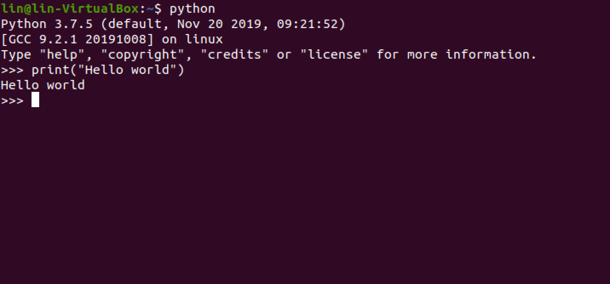
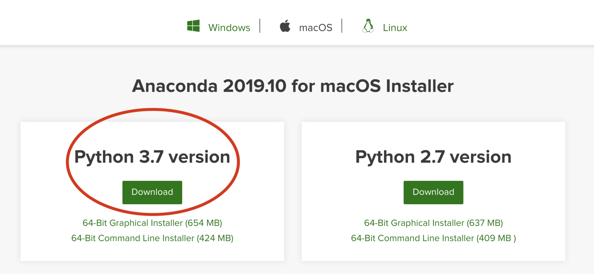
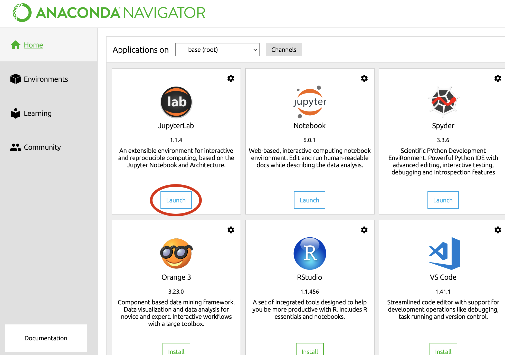

# Python Installation

Python is a widely used, high-level programming language for software and web development, scripting, and data analytics. To download and install the latest version of Python onto your computer, please follow the steps below for your respective operating system.

#### How To Install Python: 

##### **macOS / Mac OS X:**
- Download Python from the from the Python website & Install

1) Open a web browser and go to the [Python downloads page][python-download].

2) Click on the link/button to download Python 3.8.x. 

3) Open the .pkg installer in your Downloads folder and follow the installation instructions (leave all defaults as is). Enter your password if prompted. 



After the installation is complete, open the Terminal application of macOS from Application → Utilities. A bash terminal will open where you can enter commands. 

Enter the following command in the terminal, and then press “Enter” or “Return”:

```sh
$ cd
```

Next, type the command below and press “Enter” or “Return” again:

```sh
$ python
```

You should see Python version 3.x installed and can now run python code in your terminal (or IDLE editor application downloaded along with the installation). Trying printing “Hello world” using the print command.



- **Setting Python 3 as the default version in Mac OS**

If an older version of python was already pre-installed on your computer, you can change the alias of  the python command in your bash terminal to refer to the python 3.8.x version you just installed. 

To do this, add this command into your **~/.bash_profile**:

```sh
alias python='python3'
```

Open a new terminal window and now running the “python” command should invoke the latest version of python3.

##### **[Windows][windows-install-ref]**

- Download latest Python version from the Python website

Open a web browser and go to the [Python downloads page for Windows][windows-install].

Underneath the Python Releases for Windows find Latest Python 3 Release – Python 3.8.x (latest stable release as of now is Python 3.8.1):



Click on the latest stable release near the top of the page. Then on the release page, scroll down to Files and click on Windows x86-64 executable installer for 64-bit or Windows x86 executable installer for 32-bit.



- **Install latest Python version on Windows**

Run the Python Installer from the Downloads folder.  Make sure to check “Add Python 3.x to PATH” or otherwise you will have to do it explicitly. Click “Install Now” after doing so and it will start installing Python on Windows.



After installation is complete, click **Close**. The latest version of Python should now be installed. 



You can use the Command Prompt in Windows to invoke Python (or the IDLE editor application downloaded along with the installation). Go to the start menu and open the Command Prompt application. Type in ‘python’ to confirm Python was installed correctly and try entering a command to print “Hello World.”



##### **[Linux][linux-install-ref]**

- **Debian / Ubuntu (apt-get)**

Python comes pre-installed on Ubuntu Linux machines. To see which version of Python is installed, open a command prompt and run:

```sh
$ python --version
```

To update to the latest version (we will be using Python3 in this course): If you are using Ubuntu 16.10 or newer, then you can easily install Python 3.x with the following commands:

```sh
$ sudo apt-get update
$ sudo apt-get install python3
```
If you’re using another version of Ubuntu (e.g. the latest LTS release), you can use the deadsnakes PPA to install Python 3.x:

```sh
$ sudo apt-get install software-properties-common
$ sudo add-apt-repository ppa:deadsnakes/ppa
$ sudo apt-get update
$ sudo apt-get install python3
```

The latest version of Python language should now be installed on your Linux system. You can confirm it by running the command: 

```sh
$ python3 --version
Python 3.8.1
```

- **Fedora (dnf/yum)**

Other Linux systems may also have Python pre-installed. You can update to the latest version using your Linux distribution’s package manager. On Fedora, use the command:

```sh
$ sudo dnf install python3
```

Open a command prompt or shell and run the following command to verify that Python installed correctly.

```sh
$ python3 --version
Python 3.7.5
```

- **How to set Python 3 as the default version in Linux?**

You can set python3 as the default your Linux system, so that whenever you enter “python” anywhere in the terminal it always executes python3. In your **~/.bashsrc** file, add the following line:

```sh
alias python=python3
```

Then, close and restart your Terminal application. Now, any code executed will automatically use python3 as the default version.



#### Installing and Managing Python Packages Using Pip

pip is the package installer for Python. You can use pip to install packages from the Python Package Index and other indexes. Packages contain pre-written code for specific functionality not available by default in Python. For example, you can use pip to install the Scrapy package (a popular package used for scraping information from websites) by using this command:  

```sh
$ pip install scrapy 
```

If your Python version is greater than or equal to 2.7.9, pip is pre-installed. (On Linux systems, you may have to install pip manually using your Linux distribution’s package manager, see instructions [here][Linux-pip].) We will be using pip to install scrapy and other Python packages that will be used in this course. 

#### [Setting up Anaconda (Python 3.7 version) or Miniconda:][anaconda-install]

Next, we will download and install Anaconda (or Miniconda) in order to use JupyterLab. Download the correct version for your OS from the [Anaconda site][anaconda-website].

→ Be sure to download the Python 3.x version, not 2.7! ← 



After downloading the installer, go through the prompts to complete installation. After installation, you can go to Anaconda-Navigator to launch JupyterLab.



Alternatively, you can install Miniconda instead [here][miniconda].

Miniconda is a free minimal installer for conda. It is a small, bootstrap version of Anaconda that includes only conda, Python, the packages they depend on, and a small number of other useful packages, including pip, zlib and a few others.

For more info on whether to install Anaconda or Miniconda, please read the [comparison FAQ][anaconda-faq].

For this course, we recommend installing Anaconda if you are new to Python.

[python-download]: <https://www.python.org/downloads/>
[windows-install-ref]: <https://www.geeksforgeeks.org/download-and-install-python-3-latest-version/>
[windows-install]: <https://www.python.org/downloads/windows/>
[linux-install-ref]: <https://docs.python-guide.org/starting/install3/linux/>
[linux-pip]: <https://packaging.python.org/guides/installing-using-linux-tools/#installing-pip-setuptools-wheel-with-linux-package-managers>
[anaconda-install]: <https://docs.continuum.io/anaconda/install/>
[anaconda-website]: <https://www.anaconda.com/distribution/#download-section>
[miniconda]: <https://docs.conda.io/en/latest/miniconda.html>
[anaconda-faq]: <https://docs.conda.io/projects/conda/en/latest/user-guide/install/download.html#anaconda-or-miniconda>